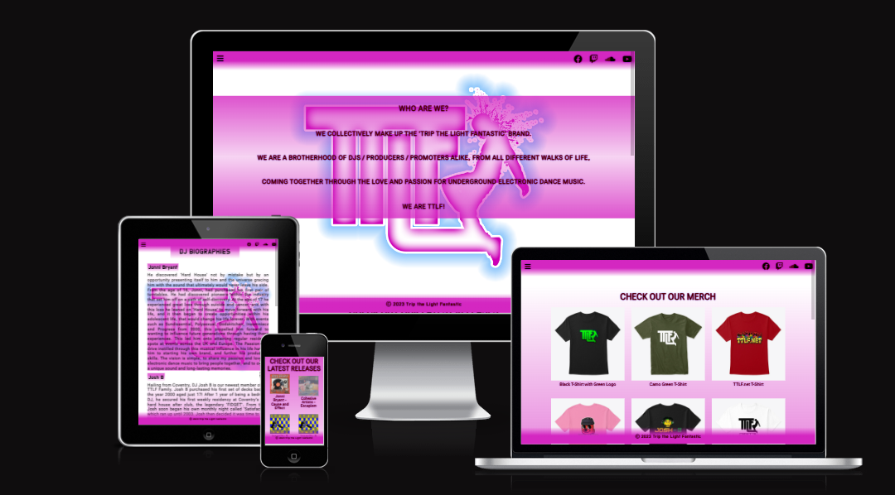
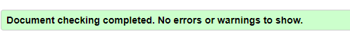
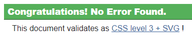
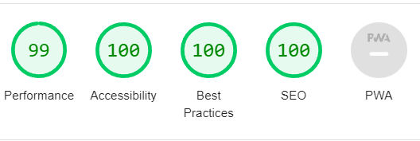
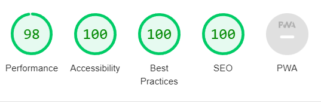

# Trip the Light Fantastic

Trip the Light Fantastic is a site for information about the digital record label run by 4 knowledgable and enthusiastic friends from the Midlands, UK. 
The site is aimed at followers and fans and will allow them to learn more about the owners by way of a DJ profile page, a gallery of latest track releases, and also to view and buy branded merchandise from an external webshop (webshop is embedded).

## Key Project Goals

* As a Company
  * To provide information about who we are and what we do.
  * Generate interest as soon as the user lands on the site.
  * To allow users of the site to see a selection of our newest products.
  * To generate income from our products.

* As a designer
  * To allow users to visit the site from any device and ensure that all content is easily viewed without distraction from other elements or any overlapping content.
  * To allow users to easily move around the site without having to spend time trying to figure out how to navigate between areas or pages.
  * To provide relevant information to the user.
_____

## Features and Theme

I have chosen colours that match the brand logo that I have used as the hero image across all pages.
I used rgba(212, 39, 193, 1) an added a gradient to transparent for the header, footer and any elements within the pages which can be seen in the images both above and below.

### Main Page
The site lands on a page displaying the brand logo, a short 'about us' section and a gallery of the latest track releases from the label.

* Navigation and header

There is a hamburger menu which opens to display links to the pages contained within the site (DJ profiles & merch store). This is displayed across all 3 pages to allow for easier, more intuitive navigation.

  * Latest Releases:

As you scroll down the page, there is a grid view showing the music that has most recently been released by the label, which can be purchased by clicking the link to go to an external site [Toolbox Digital Shop](https://www.toolboxdigitalshop.com/).

### DJ Profiles

On this page, there is biography information to tell the reader more about the co-founders of the record label. The styling follows from the home page to create or more fluid user experience.

### Merchandise

Here I have included an embedded version of the merchandise store where the reader can browse and purchase branded clothing items

All pages are responsive when viewed on smaller devices, where the content resized to fit the screen and improve viewability.

_____

## Testing
### HTML
All pages have passed through an HTML validator any any errors have been corrected
Errors found:
* 1 unclosed dev element on Merch page. this was fixed and when the checker was run again, there were no errors.

### CSS
The css has also been passed through a validator and 1 error has been corrected.
Errors found:
* Padding-left on the media query for smaller devices was not needed. this has been removed.

### Lighthouse
After lighthouse testing, It showed that I needed to add an aria-label to the dropdown menu button. After adding, the lighthouse test was much better. 

Desktop

Mobile

 

The only remaining issue was in the "Best Practices" section, where any errors came from the embedded content, not my code.

___

### Errors & Debugging
While running the code through a validty checker, I had included a 'div' inside an 'h2' element on the profiles page. All instances were corrected and there are no longer any errors

In my css stylesheet, I had put the incorrect number in an rbga element for transparency. The value of 255 was corrected to 1

Throughout the project, I was checking the responsivity for smaller devices, debugging using devtools in Chrome and adjusting any elements accordingly. The main issue i had was the positioning of the hero text on the home page, which was sitting too low on smaller devices. This was fixed with a media query to reposition the element when viewed on a mobile phone.
_____

## Deployment

The site was created in gitpod, and pushed to github to make it publicly accessible using the following commands in the terminal:

  * git add .
  * git commit -m "Description of updates since last commit"
  * git push
_____

## Credits

### Code

* Code for 'latest releases' grid found on [Codepen](https://codepen.io/TexV/pen/pwywNW) and amended to suit my requirements.

* Color gradient css code from [w3schools CSS Gradients](https://www.w3schools.com/css/css3_gradients.asp) and amended to suit my requirements.

* Code and Styling for the dropdown menu taken from [w3schools Hoverable Dropdown Menu](https://www.w3schools.com/howto/howto_js_dropdown.asp) and amended to suit my requirements.

### Content & Media

* Content included in the site, including logos and bio text has been taken from [ttlf.net](ttlf.net) (the brands' current live site) and from the TTLF logo pack which was provided to me from the label owners.

* Content and images from latest releases section on homepage has been taken from [toolbox digital shop](https://www.toolboxdigitalshop.com/trip-the-light-fantastic.html)

### Fonts and Icons 
 
 * Fonts from Google fonts

* Icons from Fontawesome