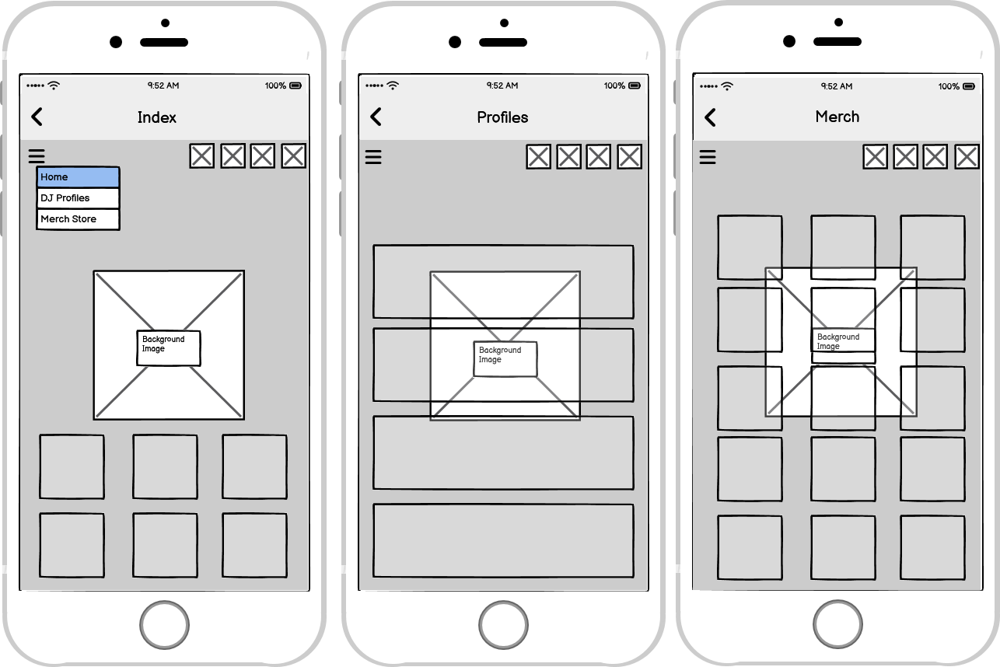
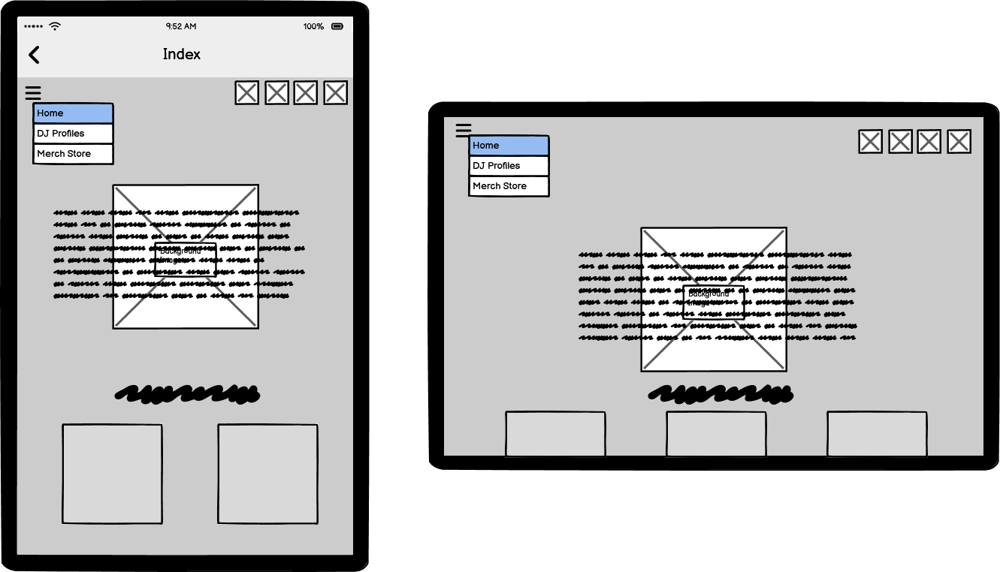
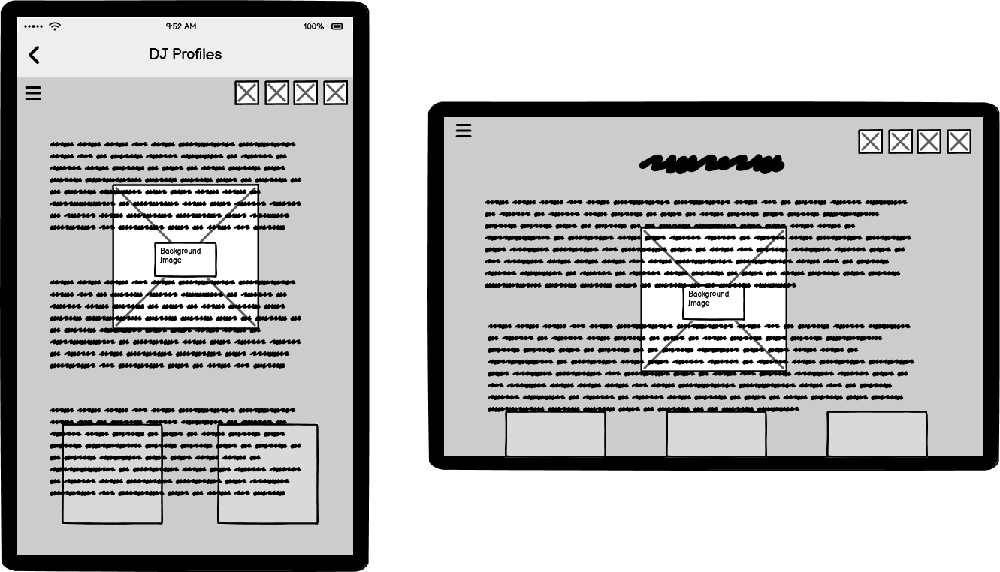
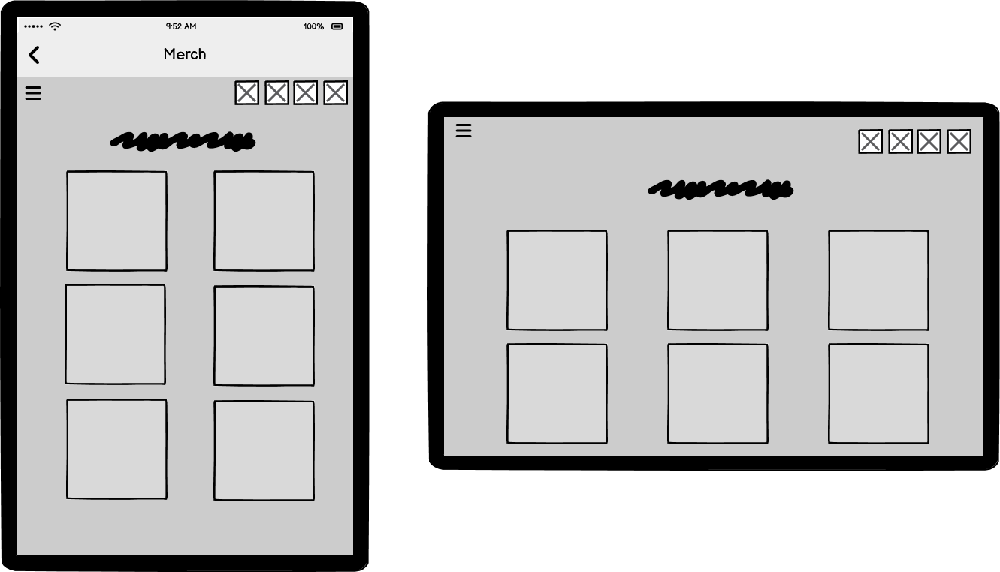
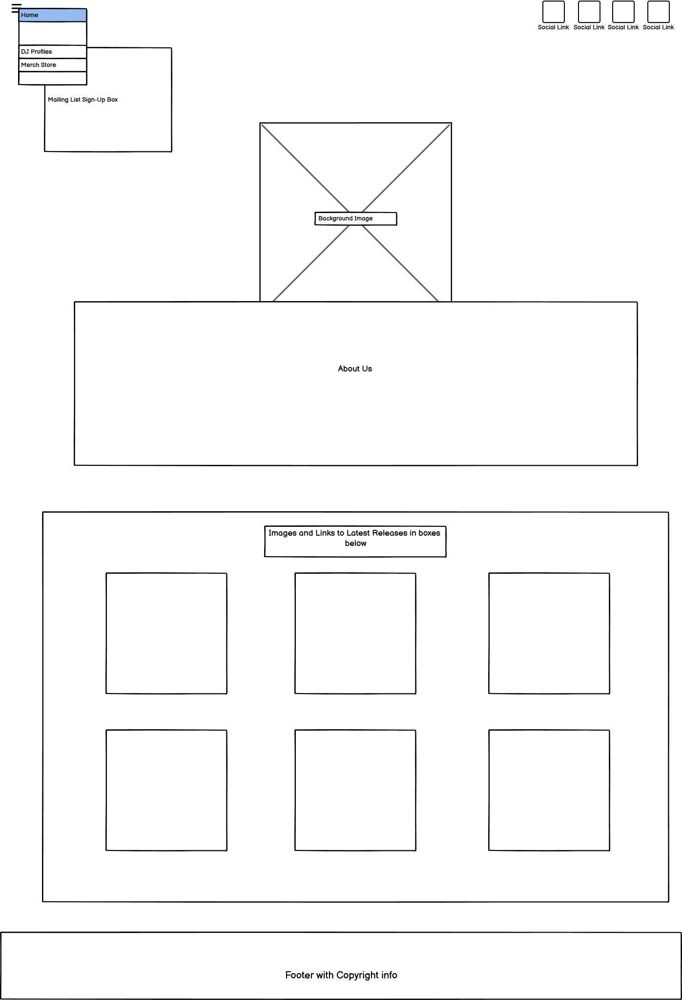
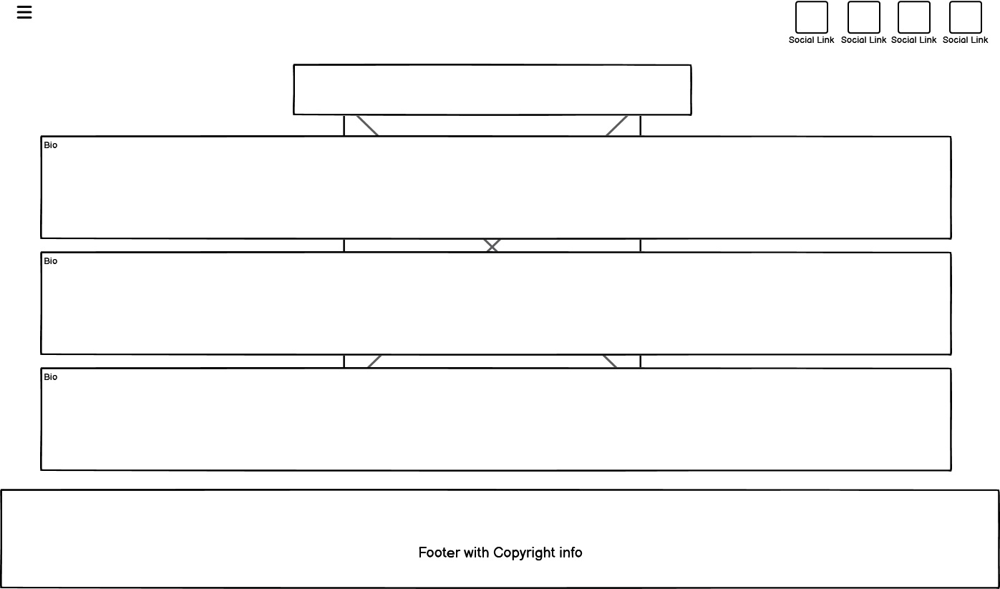
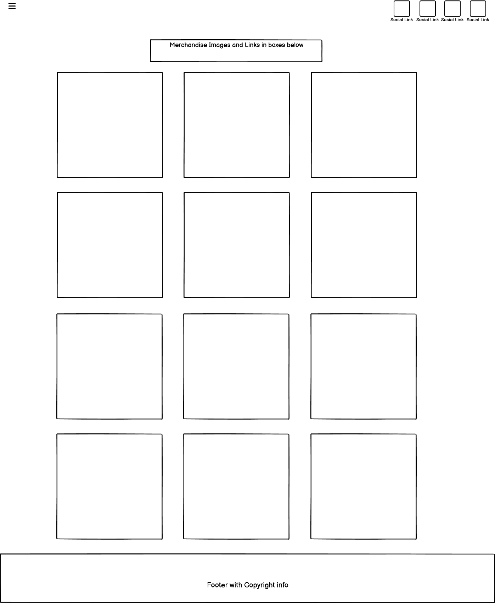

# Trip the Light Fantastic

Trip the Light Fantastic is a site for information about the digital record label based in Midlands, UK. 
The site is aimed at both new and returning visitor and will allow them to learn more about the owners by way of a DJ profile page, a gallery of latest track releases and a gallery of merchandise with links to buy items.

[View live page on Github Pages](https://markdaniel1982.github.io/ttlf_pp1/index.html)
_____
## Key Project Goals

### Site Owner
  * To provide information about who we are and what we do.
  * To engage interest as soon as the user lands on the site.
  * To allow users of the site to see a selection of our newest products.
  * To generate income from our products.

### First Time Users
  * To find out who we are and what we do
  * To find it instinctively easy to navigate the site
  * To easily find links to social network accounts to access more content

### Returning Users
  * To keep up-to-date with, or to buy releases and merchandise 

_____

## Wireframes

* Mobile

* Tablet

* Desktop

_____
## Design, Features and Theme

I have chosen colours that match the brand logo that I have used as the hero image across both the main landing page and the DJ profiles page. I have not included it on the merch page as the grid container covered the image, making it a redundant element on that page.
I used rgba(212, 39, 193, 1). A gradient to transparent was added for the header, footer and any elements within the pages which can be seen in the images in this document.

### Main Page
The site lands on a page displaying the brand logo, a short 'about us' section and a gallery of the latest track releases from the label.

* Navigation and header

There is a hamburger menu which opens to display links to the pages contained within the site (DJ profiles & merch store). This is displayed across all 3 pages to allow for easier, more intuitive navigation.

  * Latest Releases:

As you scroll down the page, there is a grid view showing the music that has most recently been released by the label, which can be purchased by clicking the link to go to an external site [Toolbox Digital Shop](https://www.toolboxdigitalshop.com/).

Below the latest releases, there is a form to join a mailing list where you can enter an email address and submit via the "Sign me up" button (This is currently not live IRL as the brand does not currently have a mailing list, but for the purposes of this project, I wanted to include it as a demonstration)

### DJ Profiles

On this page, there is biography information to tell the reader more about the co-founders of the record label. The styling follows from the home page to create or more fluid user experience.

### Merchandise

Here I have included another grid view, similar to the "Latest Releases" on the homepage, where several different items are shown with pictures and a brief description of the item. All pictures are links which take you to the merchandise store where branded clothing items can be purchased

All pages follow the same, or very similar styling rules where the colours and fonts used match throughout.
_____

## Testing
### HTML
All pages have passed through an HTML validator any any errors have been corrected
Errors fixed:
* 1 unclosed div element on Merch page.

### CSS
The css has also been passed through a validator and 1 error has been corrected.
Errors found:
* Padding-left on the media query for smaller devices was not needed. this has been removed.

### Responsivity

All pages have been regularly checked for any responsivity issues throughout the project to ensure that all required elements were responsive to allow them to be clearly seen on all devices. Any issues were found and debugged using the devtools in the Chrome browser. One of the main issues I had was items overlapping on the home page when viewed on smaller devices. This was fixed using Chrome Devtools to diagnose the problem, and then implimented in the relevant code.

### Lighthouse
After lighthouse testing, It showed that I needed to add an aria-label to the dropdown menu button.

Desktop

Mobile

 

___

### Errors & Debugging
While running the code through a validty checker, I had included a 'div' inside an 'h2' element on the profiles page. All instances were corrected and there are no longer any errors

In my css stylesheet, I had put the incorrect number in an rbga element for transparency. The value of 255 was corrected to 1

Throughout the project, I was checking the responsivity for smaller devices, debugging using devtools in Chrome and adjusting any elements accordingly. The main issue i had was the positioning of the hero text on the home page, which was sitting too low on smaller devices. This was fixed with a media query to reposition the element when viewed on a mobile phone.

#### Unresolved Bugs
One difficult issue I found was that my background image wasnt showing at all when the site was deployed to github pages. After extensive searching online, the only fix I was able to find that worked, was to change the link in the style sheet so it was pointing externally to the image within my github. Obviously, this is far from ideal. and I will continue to search for a more permanent fix.
_____

## Deployment

The site was created in gitpod, and pushed to github to make it publicly accessible using the following commands in the terminal:

  * git add .
  * git commit -m "Description of updates since last commit"
  * git push

  Then, in Github, select the Repository > Settings > Pages. Then, under "Build and deployment" Select the required branch to publish from the dropdown menu, and Save.
  Once the updates have been pushed from Gitpod, they will show on the deployed page, usually after a minute or two.
_____

## Credits

### Code

* Code for 'latest releases' and 'Merchandise' grid found on [Codepen](https://codepen.io/TexV/pen/pwywNW) and amended to suit my requirements.

* Color gradient css code from [w3schools CSS Gradients](https://www.w3schools.com/css/css3_gradients.asp) and amended to suit my requirements.

* Code and Styling for the dropdown menu taken from [w3schools Hoverable Dropdown Menu](https://www.w3schools.com/css/css_dropdowns.asp) and amended to suit my requirements.

* Code and Styling for mailing list sign up section taken from [w3schools CSS Newsletter](https://www.w3schools.com/howto/howto_css_newsletter.asp) and amended to suit my requirements

### Content & Media

* Content included in the site, including logos and bio text has been taken from [ttlf.net](ttlf.net) (the brands' current live site) and from the TTLF logo pack which was provided to me from the label owners.

* Content and images from latest releases section on homepage has been taken from [toolbox digital shop](https://www.toolboxdigitalshop.com/trip-the-light-fantastic.html)

### Fonts and Icons 
 
* Fonts from Google fonts

* Icons from Fontawesome